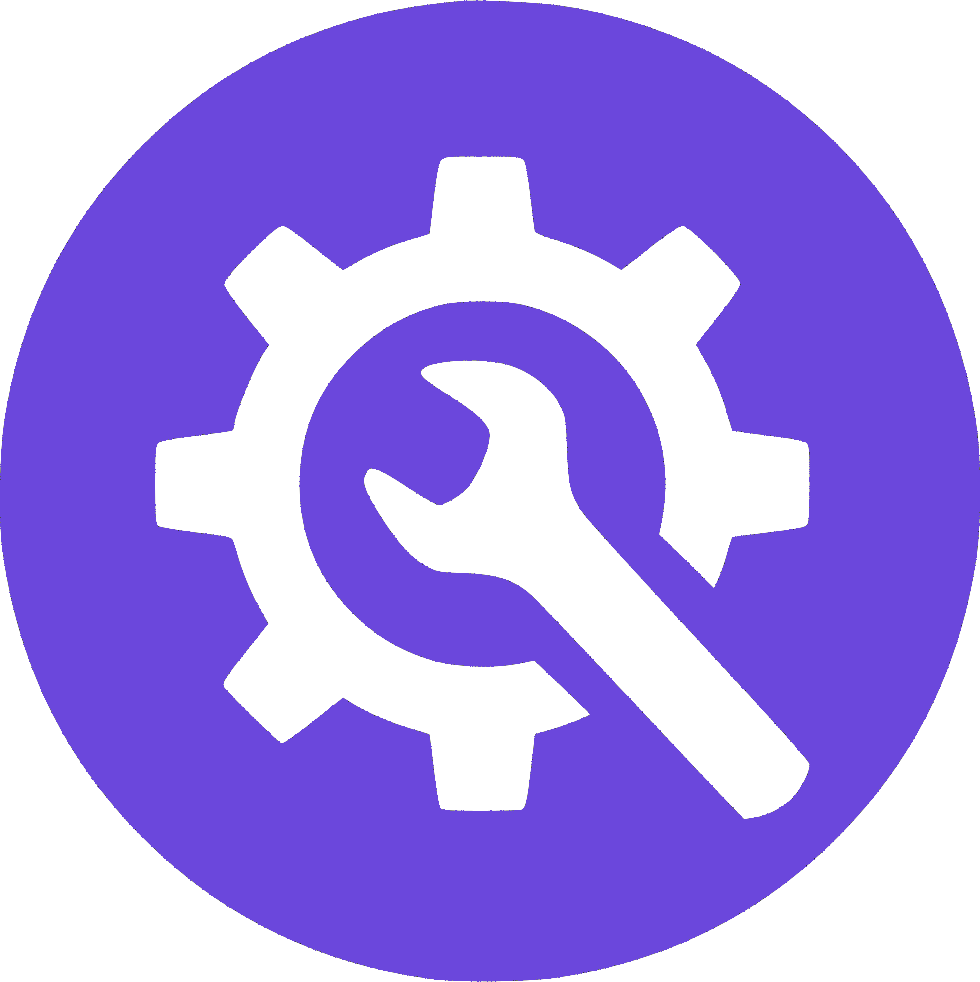

 <a name="readme-top"></a>

 <div align="center">

  <!-- LOGO -->
   
   <br/>

 
   <h3><b>Link Sharing App</b></h3>

 </div>

 
 # 📗 Table of Contents

 - [📖 About the Project](#about-project)
   - [🛠 Built With](#built-with)
     - [Key Features](#key-features)
 - [🚀 Live Demo](#live-demo)
 - [💻 Getting Started](#getting-started)
   - [Setup](#setup)
   - [Prerequisites](#prerequisites)
   - [Deployment](#deployment)
 - [👥 Authors](#authors)
 - [🔭 Future Features](#future-features)
 - [🤝 Contributing](#contributing)
 - [⭐️ Show Your Support](#support)
 - [🙏 Acknowledgements](#acknowledgements)
 - [📝 License](#license)

 
 # 📖 Link Sharing App <a name="about-project"></a>

 > devlinks is an intuitive link-sharing platform tailored for developers to curate and share their top resources, projects, and insights with the community. Built with React and SCSS, it offers users the ability to create profiles, add links, and view live previews on a mock phone interface. With a responsive design, it ensures a seamless experience across all devices. Additionally, features like local storage for data management allow users to effortlessly edit, update, and delete their links.

 ## 🛠 Built With <a name="built-with"></a>
 - React
 - SCSS
 - JavaScript

 
 ### Key Features <a name="key-features"></a>
 1. User profiles for a personalized experience
 2. Seamless link addition with live previews
 3. Fully responsive design for accessibility across devices

 <p align="right">(<a href="#readme-top">back to top</a>)</p>

 
 ### 🚀 Live Demo

 > Experience the power of devlinks in action! Watch the [live demo](#) of the app or visit the app [page](#) to explore its features.

 <p align="right">(<a href="#readme-top">back to top</a>)</p>


 ## 💻 Getting Started <a name="getting-started"></a>

 > To get your own local copy of the project, follow these steps:

 ```sh
 git clone https://github.com/BHObserver/Link-sharing-app.git
 cd link-sharing-app
 ```

 ### Setup

 Set up this project by running the following commands:

 ```sh
 npm install
 npm start
 ```

 ### Prerequisites

 Ensure you have the following installed:
 1. A code editor of your choice
 2. Git
 3. An internet browser


 ## 👥 Authors <a name="authors"></a>

 👤 **Burhan Uddin**

 - GitHub: [@BHObserver](https://github.com/BHObserver)
 - Twitter: [@BurhanU14173360](https://twitter.com/BurhanU14173360)
 - LinkedIn: [bhobserver](https://www.linkedin.com/in/hans.dev)

 <p align="right">(<a href="#readme-top">back to top</a>)</p>

 ## 🔭 Future Features <a name="future-features"></a>

 - [ ] **User Authentication**: Implement robust signup and signin features for enhanced security.
 - [ ] **Database Integration**: Store user data in a database for persistent access and management.
 - [ ] **Firebase Authentication**: Leverage Firebase for a secure and seamless user authentication experience.

 <p align="right">(<a href="#readme-top">back to top</a>)</p>

 ## 🤝 Contributing <a name="contributing"></a>

 Contributions are not just welcome; they are essential! If you have ideas for enhancements, bug fixes, or features, please don’t hesitate to reach out or submit a pull request.

 <p align="right">(<a href="#readme-top">back to top</a>)</p>

 ## ⭐️ Show Your Support <a name="support"></a>

 If you find value in this project, please show your support by giving it a star ⭐️⭐️⭐️⭐️⭐️

 <p align="right">(<a href="#readme-top">back to top</a>)</p>

 ## 🙏 Acknowledgments <a name="acknowledgements"></a>

 This project was inspired by a challenge from Frontend Mentor. A heartfelt thank you to the creators and community for their invaluable resources and support!

 <p align="right">(<a href="#readme-top">back to top</a>)</p>

 ## 📝 License <a name="license"></a>

 This project is licensed under the [MIT](./LICENSE) license.

 <p align="right">(<a href="#readme-top">back to top</a>)</p>
